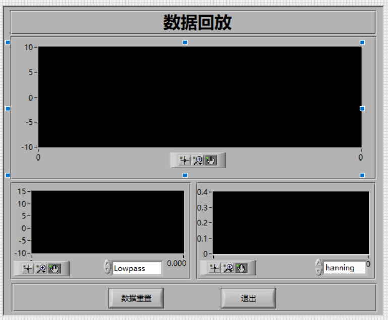

# LabVIEW Projects

记录我制作的一些基于 LabVIEW 开发的小项目

## 项目列表

### 交通灯控制系统（TrafficLightSystem）

- 描述：红绿黄三灯定时切换，含倒计时，根据人流车流自动调整红绿灯时间等
- 路径：`/01.TrafficLightSystem`
- 前面板：

### 温度监测系统（TemperatureMonitor）

- 描述：模拟温度采集与报警系统。
- 路径：`/02.TemperatureMonitor`
- 前面板：

### 电容充放电测试系统（CapacitorPerformanceTest）

- 描述：模拟电容测试充电放电时电压变化。
- 路径：`/03.CapacitorPerformanceTest`
- 前面板：
- 

### 无人机外部环境监测 （UAV external environment monitoring）

- 描述：根据数据文件回放温湿度和加速度曲线。
- 路径：`/04.UAV external environment monitoring`
- 前面板：

### 双通道数据采集处理系统 （Dual-channel data acquisition and processing system）

- 描述：根据数据文件回放温湿度和加速度曲线。

- 路径：`/05.Dual-channel data acquisition and processing system`

- 前面板：
  
  

## 使用方式

1. 下载或克隆本仓库；
2. 使用 NI LabVIEW 2024版或以上版本打开每个子目录中的 `.lvproj` 或`.vi`文件；
3. 运行主 VI 文件查看效果。
